# Animation Portfolio Project

[View the live website here](https://gar-16.github.io/Project1/index.html)

When trying to think of what I could build for my first project, a portfolio webiste was one of the first things that came to mind. Being an animator it was an easy choice to combine both areas of my life into one. The site was made for the creator to share with employers and viewers, to give them a an all in one hub to see the talents and skills of the creator should they wish to hire them. As well as providing some small background information about them and contact info so that they an get in touch. 

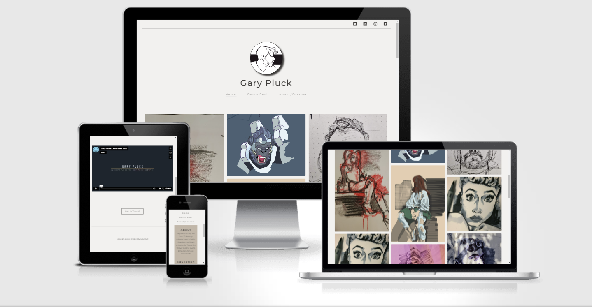

## Features

### Existing Features

- __Navigation Bar__
  - The Navigation bar is visable on all three pages, it provides links to the Home page, the Demo Reel page and to the About/Contact page.
  - sfsf

- __Gallery Section__ 
  - The Gallery section showcases various artworks to demonstrate the artists visual skills.
  - This can be used by employers to see the artists style and visual development.

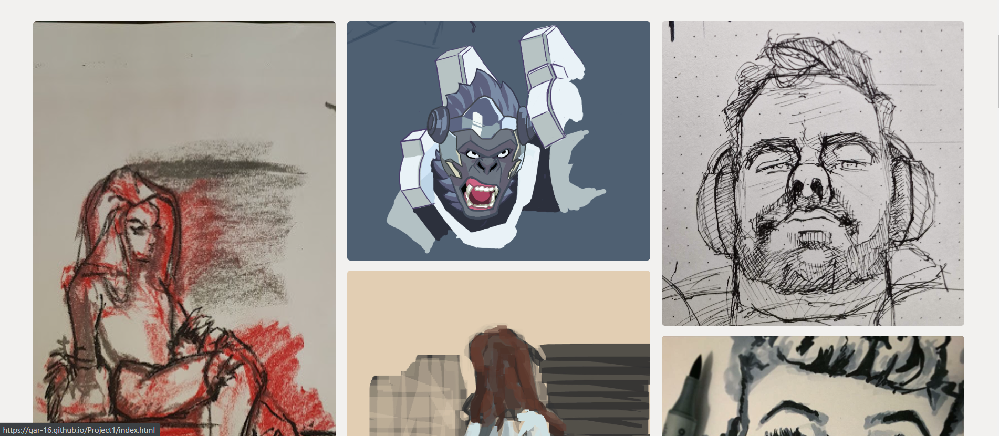

- __Get In Touch__
  - The Get In Touch button is a handy section that is near the bottom of each page that is clear to see and link to the contact page.
  - Visitors to the site can use this link on any page to quickly jump to the contact page should they decide to discuss work or potential projects. 

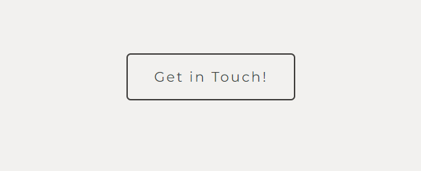

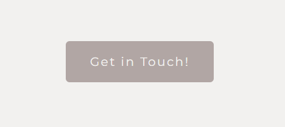

- __Demo Reel__
  - The Demo Reel was added for to showcase some clips of animation to show the creators skills in animation.
  - Visitors can view the video embedded in page 

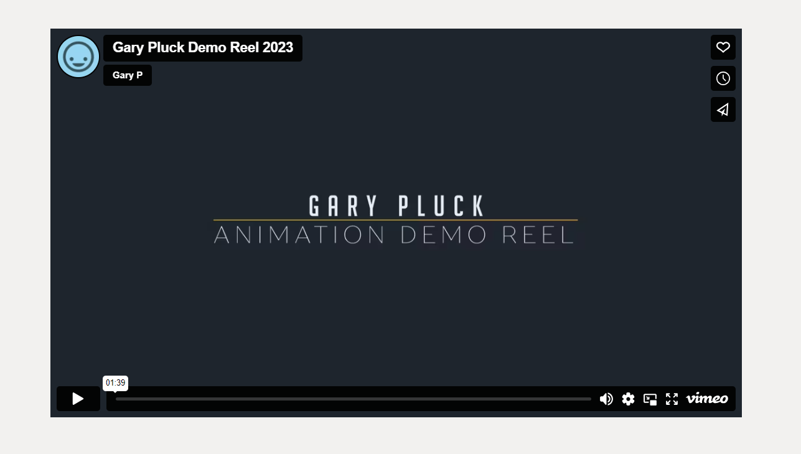

- __About Me__
  - A small section that gives a small background on the creator and the artist's email address.
  - Visitors can use this to get a preview of the artist's animation skills.

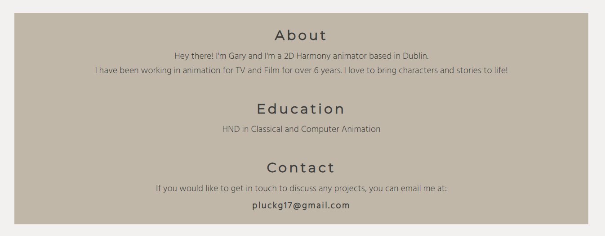

## Testing 

### Validator Testing
- HTML
  -  No errors were returned when passing through the official W3C validator
  
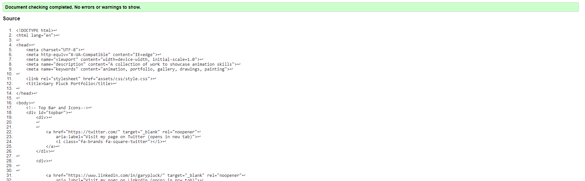
  
- CSS
  - No errors were returned when passing through the official Jigsaw validator 

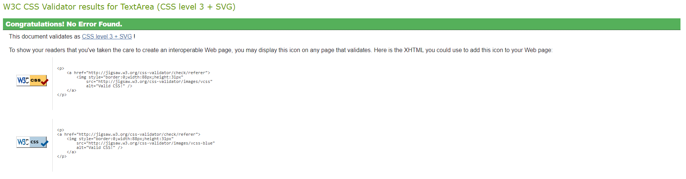

### Lighthouse Testing

- Index Page Lighthouse Test
  
    
    
- Demo Reel Lighthouse Test

    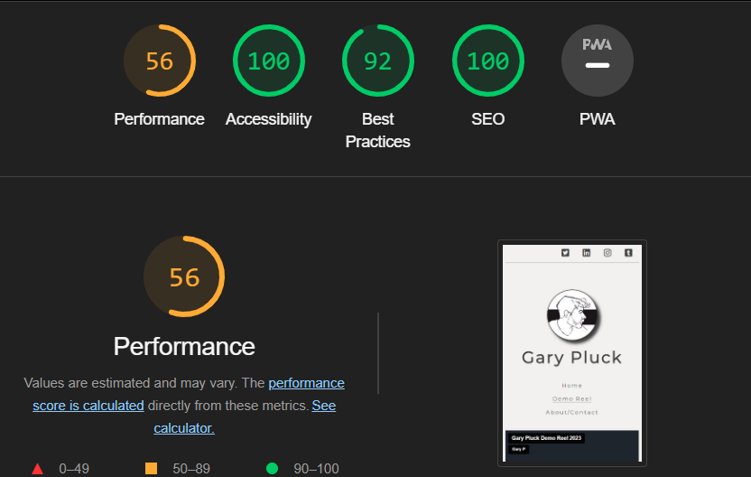

- About Lighthouse Test

    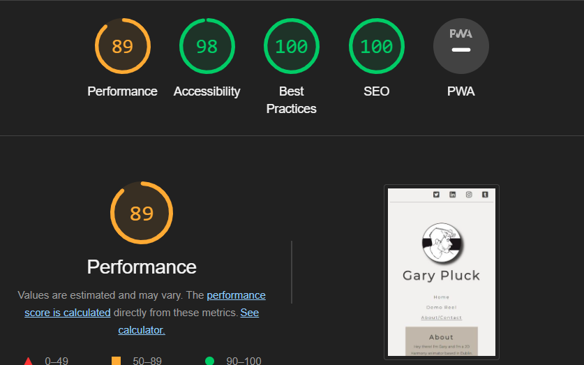

### Bugs

- Had an issue with one image not loading when site was deployed but loaded in preview. Issue was because of using an absolute path. Fixed when adjusted correctly.
  
  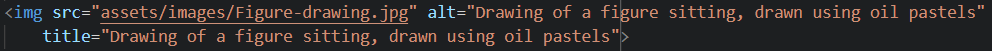

- Had an issue with the "Get in Touch!" button now showing correctly. Found it was because I needed the button attribute inside the a attribute. Although this fixed the issue and the code worked and showed up. It was not correct according to the validator. I then got rid of the button attribute and instead styled the button from using CSS 

    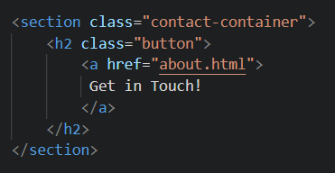

- While embedding the video, and using the emmbedding code provided by Vimeo, I was havinng an issue with positioning and sizing the video. I found that this was because the HTML code that was imported had styling within it and this had to be removed as it was over writing any CSS style i tried to apply. Width and Height were kept in as this can not be adjusted in CSS.

    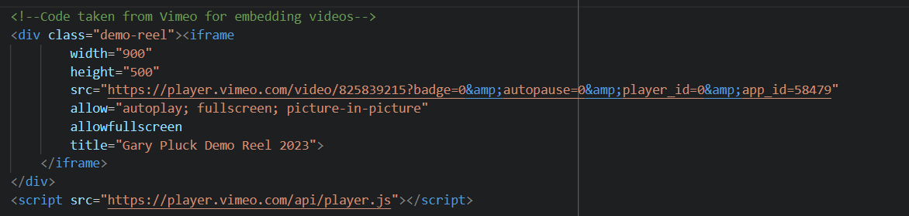

### Browser Compatability

- Site was built and works with Google Chrome

- Site has been test and works with Microsoft Edge

- Site has been test and works with Firefox 
  
- Site has been test and works with Opera 

# Deployment

- The site was deployed to GitHub pages. The steps to deploy are as follows:
  - In the GitHub repository, navigate to the Settings tab
  
  - From the source section drop-down menu, select the Master Branch
  
  - Once the master branch has been selected, the page will be automatically refreshed with a detailed ribbon display to indicate the successful deployment.

The live link can be found here: <https://gar-16.github.io/Project1/index.html>

# Credits

## Content

- The icons in the top bar of the page were taken from [Font Awesome](https://fontawesome.com/)
- The Code for the Embedded video was taken from [Vimeo](https://vimeo.com/)
- The code for the responsive Gallery and styling, was taken from [this Youtube video](https://www.youtube.com/watch?v=Trw_9lisYVY)
- The Code for nav bar referenced from Love Running Project
- Styling and hover transition code taken from [W3Schools](https://www.w3schools.com/css/css3_buttons.asp)
  

## Media
- All images used are my own
