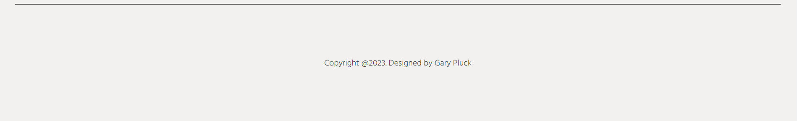

# Animation Portfolio Project

[View the live website here](https://gar-16.github.io/Project1/index.html)

When trying to think of what I could build for my first project, a portfolio webiste was one of the first things that came to mind. Being an animator it was an easy choice to combine both areas of my life into one. The site was made for the creator to share with employers and viewers, to give them a an all in one hub to see the talents and skills of the creator should they wish to hire them. As well as providing some small background information about them and contact info so that they an get in touch. 

## Features

### Existing Features

- __Navigation Bar__
  - dfss
  - sfsf

- __Gallery Section__ 
  - kldjf 
  - sdfg

- __Get In Touch__
  - skdflsk
  - sdfsdg 

- __Footer__
  - sfdsg
  - fgdfg 

- __Demo Reel__
  - fd;aslf
  - dfgsd

- __About Me__
  - sdfgs
  - sdfgsdgf

