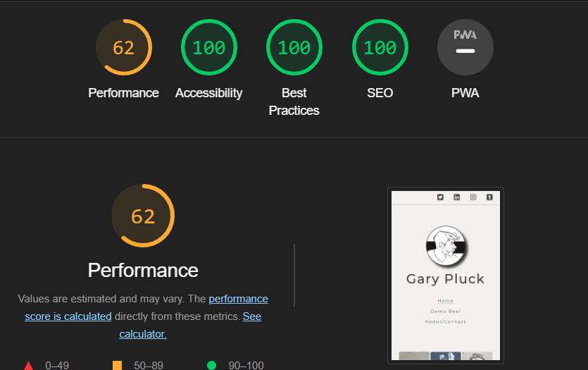

# Animation Portfolio Project

[View the live website here](https://gar-16.github.io/Project1/index.html)

When trying to think of what I could build for my first project, a portfolio webiste was one of the first things that came to mind. Being an animator it was an easy choice to combine both areas of my life into one. The site was made for the creator to share with employers and viewers, to give them a an all in one hub to see the talents and skills of the creator should they wish to hire them. As well as providing some small background information about them and contact info so that they an get in touch. 

## Features

### Existing Features

- __Navigation Bar__
  - The Navigation bar is visable on all three pages, it provides links to the Home page, the Demo Reel page and to the About/Contact page.
  - sfsf

- __Gallery Section__ 
  - The Gallery section showcases various artworks to demonstrate the artists visual skills.
  - This can be used by employers to see the artists style and visual development.

- __Get In Touch__
  - The Get In Touch button is a handy section that is near the bottom of each page that is clear to see and link to the contact page.
  - Visitors to the site can use this link on any page to quickly jump to the contact page should they decide to discuss work or potential projects. 

- __Demo Reel__
  - The Demo Reel was added for to showcase some clips of animation to show the creators skills in animation.
  - Visitors can view the video embedded in page 

- __About Me__
  - A small section that gives a small background on the creator and the artist's email address.
  - Visitors can use this to get a preview of the artist's animation skills.

## Testing 

### Validator Testing
- HTML
  - - No errors were returned when passing through the official W3C validator
  

  
- CSS
  - No errors were returned when passing through the official Jigsaw validator 

### Lighthouse Testing

- Index Page Lighthouse Test
  
    
    
- Demo Reel Lighthouse Test

    

- About Lighthouse Test

    
